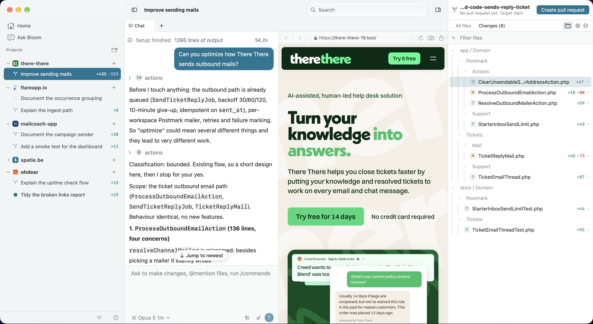

# Bloom

An agent development environment, native to the Mac.

[](https://github.com/spatie/bloom/actions/workflows/test.yml)
[](https://github.com/spatie/bloom/releases)

[](https://runbloom.app)

Bloom runs coding agents in git worktrees. One window holds a sidebar of projects and the
workspaces under them, the agent's conversation in the centre, and what it changed on the right. A
workspace is a real worktree on disk with a branch of its own, so a dozen tasks can run at once
without treading on each other.

Describe a task and Bloom cuts the branch, cuts the worktree, copies the files you named across,
runs your setup script and starts an agent in it. You read the transcript while it works, review
the diff against the merge base, open a terminal standing in the worktree, and open and merge the
pull request from the same window.

It is written in Swift on the system frameworks, with two dependencies: SwiftTerm for the terminal
panes and Sparkle for updates. There is no account to create. Bloom drives the agent CLIs already
installed on your Mac.

## Support us

We invest a lot of resources into creating [best in class open source packages](https://spatie.be/open-source).
You can support us by [buying one of our paid products](https://spatie.be/open-source/support-us).

Bloom is postcardware. It is free to use, and we highly appreciate you sending us a postcard from
your hometown, mentioning what you are building with it. You'll find our address on
[our contact page](https://spatie.be/about-us). We publish all received postcards on
[our virtual postcard wall](https://spatie.be/open-source/postcards).

## Installation

Bloom needs macOS 26 or later.

Download the disk image from [runbloom.app/download](https://runbloom.app/download), or from the
[releases page](https://github.com/spatie/bloom/releases), and drag Bloom into your Applications
folder. Every release is signed, notarised and stapled, then published to a Sparkle appcast, so an
installed copy offers you each new version as it lands.

Bloom ships no agent of its own. It runs the CLIs you have installed:

- `claude` ([Claude Code](https://claude.com/claude-code)) or `codex`
  ([Codex](https://developers.openai.com/codex/cli)), at least one of the two on your `PATH`. Each
  chat picks one, so a single workspace can hold chats on both.
- `git`.
- `gh` ([GitHub CLI](https://cli.github.com)), for the pull request and checks features.

Cursor (`cursor-agent`) and OpenCode (`opencode`) are detected and reported on the Agents settings
screen, but neither has a backend in Bloom, so neither is offered where a chat is started.

### Building from source

You need Xcode 26, or a Swift 6.2 toolchain.

```bash
git clone https://github.com/spatie/bloom.git
cd bloom
make app
```

`make` on its own lists every target. `make app` assembles a debug `Bloom.app` into SwiftPM's build
directory, which is what you want while changing things, and `make run` builds a release copy and
launches it.

There is no `.xcodeproj`, on purpose. Open `Package.swift` in Xcode and you get the targets, the
schemes, the debugger and the previews; `CLAUDE.md` has the section explaining what a checked-in
project file would and would not add.

## Usage

**Projects and workspaces.** Add a git repository as a project. Each task you describe becomes a
workspace: a branch, a worktree cut under `~/bloom/workspaces.noindex`, and an agent started in it.
The `.noindex` suffix keeps Spotlight out of them, which is what a dozen worktrees of one project
need once each of them holds its own copy of `vendor` and `.build`. A workspace can also be started
on an existing branch, or on a GitHub pull request, to review one rather than write one.

**Panes.** A workspace holds tabs, and a tab can be split. A pane is a chat, a terminal standing in
the worktree, or a browser, so the dev server the setup script started can be read beside the
conversation that is changing it.

**Review and ship.** The inspector lists the files the workspace changed and shows a
syntax-highlighted diff against the merge base, with inline comments and an editor on the same
file. When `gh` is installed it also carries the pull request: open it, watch its checks, merge it.

**Ask Bloom.** A conversation that belongs to no workspace, for the questions that are about your
projects rather than about one branch.

**Quick prompts.** A library of prompts you reuse, available in any workspace.

**Subagents.** An agent can start a second agent in the same worktree on the same branch, hand it a
task, message it and stop it again. Both show in the sidebar under the workspace they belong to.

### Per-repository settings

A repository configures itself through `.bloom/settings.toml`, layered under
`~/.bloom/settings.toml` and over it by `.bloom/settings.local.toml`, with the later file winning.
Everything in there is also editable from the repository's settings screen, which writes back to
the file the value came from.

The keys are `scripts.setup`, `scripts.archive`, `scripts.run` (a string, or a table of named
scripts with a `command`), `scripts.run_mode`, `file_include_globs` (`[".env*"]` by default),
`git.branch_prefix`, `git.branch_prefix_type`, `git.delete_branch_on_archive`, `models.default` and
`models.claude.default_thinking_level`. A key ending in `_file` (`scripts.setup_file`,
`scripts.archive_file`) names an executable file in the repository instead of an inline command.

Every script Bloom runs is handed these variables on top of your own shell environment:

| Variable | Meaning |
| --- | --- |
| `BLOOM_IS_LOCAL` | Always `1`. There is no cloud mode |
| `BLOOM_WORKSPACE_NAME` | The branch name with slashes replaced by dashes |
| `BLOOM_WORKSPACE_ID` | The workspace's internal id |
| `BLOOM_WORKSPACE_PATH` | The worktree directory |
| `BLOOM_PROJECT_NAME` | The project's folder name, cleaned down to letters, digits and underscores |
| `BLOOM_ROOT_PATH` | The main checkout |
| `BLOOM_DEFAULT_BRANCH` | The repository's default branch |
| `BLOOM_PORT` | The first of ten ports allocated to this workspace |

#### A database per worktree

`scripts.setup` and `scripts.archive` are a pair, and together they are the whole answer to what a
worktree does about its database. Setup makes one, archive drops it. Nothing else has to reap
anything, because Bloom will not remove the worktree unless the archive script succeeded.

```toml
[scripts]
setup_file = ".bloom/setup.sh"
archive_file = ".bloom/archive.sh"
```

```bash
#!/usr/bin/env bash
# .bloom/setup.sh, committed and chmod +x. Without the shebang and the executable bit, the file's
# contents are run through zsh instead, which is fine too.
set -euo pipefail

# Both halves: the project, because a branch called main exists in every repository you own, and
# the branch, because you want one database per worktree. Underscores because MySQL will take
# hyphens only in backticks, and 64 characters because that is where it stops taking anything.
database="${BLOOM_PROJECT_NAME}_${BLOOM_WORKSPACE_NAME//-/_}"
database="${database:0:64}"

cp "$BLOOM_ROOT_PATH/.env" .env
sed -i '' "s/^DB_DATABASE=.*/DB_DATABASE=$database/" .env
sed -i '' "s#^APP_URL=.*#APP_URL=http://localhost:$BLOOM_PORT#" .env

mysql -u root -e "CREATE DATABASE IF NOT EXISTS \`$database\`"

composer install --quiet
npm ci --silent
php artisan migrate --force
php artisan db:seed --force
```

```bash
#!/usr/bin/env bash
# .bloom/archive.sh
set -euo pipefail

database="${BLOOM_PROJECT_NAME}_${BLOOM_WORKSPACE_NAME//-/_}"
database="${database:0:64}"

# IF EXISTS, because a failing archive script stops the archive, and a workspace whose setup never
# got as far as creating the database would otherwise be one nobody can ever get rid of.
mysql -u root -e "DROP DATABASE IF EXISTS \`$database\`"
```

`$BLOOM_PORT` is the same number in both, and it is the same number after a restart, so the archive
script can also bring down whatever the setup script started on it (`docker compose down -v`, or
killing what is listening). It gets ten minutes to do so.

### The bridge

An agent working in a workspace can call back into the app over MCP, through a stdio shim shipped
inside Bloom's own bundle. Thirty-six tools: opening and closing panes, driving a browser pane,
running and reading a terminal, showing an image in the chat, starting and messaging subagents,
starting and renaming workspaces, and reading the projects and workspaces Bloom holds. Each tool
carries its own gate, and which caller may reach which is the subject of `docs/BRIDGE.md`. A
workspace agent is scoped to its own worktree implicitly, so nothing it calls takes a workspace id.

You can register the same bridge in a client of your own, from Settings, and ask Bloom about your
projects from a terminal.

### Deep links

```bash
open "bloom://prompt=<urlencoded>&path=<urlencoded repo root>"
```

The path has to be a repository Bloom already has as a project. The link creates a workspace there
and starts an agent on the prompt.

## Documentation

Each of the documents under `docs/` was written by measuring something rather than by remembering
it, so they answer "has this already been worked out" rather than touring the code.

- [`docs/PROTOCOL.md`](docs/PROTOCOL.md) documents Claude Code's stream-json protocol as verified
  against the real CLI, with a captured session in `Tests/fixtures/`.
- [`docs/CODEX.md`](docs/CODEX.md) is the same for Codex's JSON-RPC app-server, plus the decisions
  that shaped the Codex backend and the work still outstanding on it.
- [`docs/AGENTS-INTEGRATION.md`](docs/AGENTS-INTEGRATION.md) is what the four agent CLIs put on
  disk, read off a real machine, and the rule that none of it may be rendered.
- [`docs/BRIDGE.md`](docs/BRIDGE.md) is the bridge the other way round: what an agent can ask Bloom
  to do, and which callers may ask for what.
- [`docs/MENUS.md`](docs/MENUS.md) is the menu bar and the keyboard shortcuts.
- [`docs/PLAN.md`](docs/PLAN.md) is the build order this was written to, kept for the bug reports
  in it: what broke, why, and what now stops it.

[`CLAUDE.md`](CLAUDE.md) is the house style: where a file goes, what belongs in the core rather than
in a view, and why the linters say what they say. [`RELEASING.md`](RELEASING.md) covers signing,
notarising and the appcast.

## Testing

`Sources/BloomCore` holds everything that is not a view, and the suite runs against that alone, in
a mirrored package with no app target:

```bash
make test
```

One suite at a time, which is what you want most of the time:

```bash
./Tools/test-core.sh DiffParser
```

A green suite does not mean the app compiles, because the mirror has no app target, so compile
everything before committing:

```bash
make build
```

Two linters, and both have to pass. `make lint` is the conventions no off the shelf tool knows,
and `make swiftlint` is the half every Swift codebase shares:

```bash
make lint
make swiftlint
```

There is also a small set of live tests that drive the real `claude` binary end to end: a full turn
with tool use, session resume across two runner instances, and cancellation. They spend tokens, so
they are opt-in:

```bash
BLOOM_LIVE=1 ./Tools/test-core.sh LiveAgent
```

## Changelog

Every release, with what changed in it, is on
[runbloom.app/changelog](https://runbloom.app/changelog) and on the
[releases page](https://github.com/spatie/bloom/releases).

## Contributing

Please see [CONTRIBUTING](https://github.com/spatie/.github/blob/main/CONTRIBUTING.md) for details.

## Security

If you discover any security related issues, please email [security@spatie.be](mailto:security@spatie.be)
instead of using the issue tracker.

## Credits

- [Freek Van der Herten](https://github.com/freekmurze)
- [All Contributors](../../contributors)

## License

The MIT License (MIT). Please see [License File](LICENSE.md) for more information.
