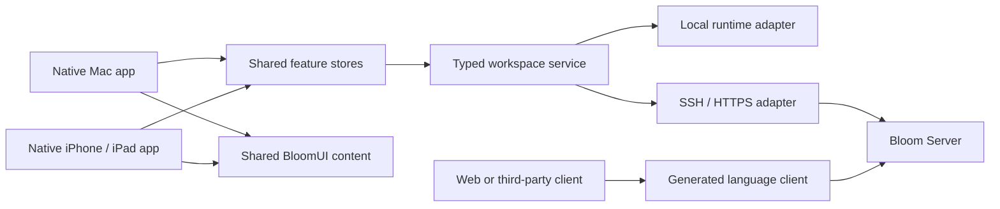

# Shared clients and a public Bloom protocol

Status and direction, 10 September 2026. Shared review state, composer choices, typed creation, transcript projection, tool presentation, native terminals and leased agent UI actions are implemented on this branch. The current wire contract is documented in [SERVER-PROTOCOL.md](SERVER-PROTOCOL.md), with schemas and an executable Python client under `Protocol/`. Generated application DTOs, a new public envelope and full feature parity remain future work.

Keep one repository and one set of feature rules. Share reusable presentation between Apple apps, with native navigation, editing, tables, menus, browser and window behaviour. A web client should consume the same server capabilities through a generated TypeScript client; it needs its own web presentation.

Apple explicitly supports local packages for modular code in one repository. Our existing packages are a good foundation; there is no reason to introduce separate repositories for every app or feature. [Apple's local-package guidance](https://developer.apple.com/documentation/xcode/organizing-your-code-with-local-packages)

| Boundary | Responsibility |
| --- | --- |
| Protocol schemas and `BloomProtocol` | Stable wire records, operations, results, events, error codes and capabilities. No database, process or UI types. |
| `BloomClient` | Shared feature stores, typed service interfaces, connection/retry policy, durable command intentions, transcript merging and revision caches. |
| `BloomUI` | Shared message, markdown, diff, file-label and other reusable content components. Platform typography and interaction adapters remain injectable. |
| Mac and iOS targets | Native navigation, panes, text editing, keyboard/focus, drag and drop, sheets, menus, lifecycle and platform integrations. |
| Bloom runtime | Authoritative projects, workspaces, sessions, agents, permissions, files, command receipts and process execution. |

`BloomProtocol` is a proposed lower-level target. Server code should eventually depend on it instead of importing an entire client module to get wire types. Keep feature stores grouped inside BloomClient initially; add further modules when a dependency boundary earns them.

A local workspace must continue to work without a remote server, account or network round trip. Its in-process service adapter should satisfy the same capability interfaces as the remote adapter. Native views should not branch repeatedly on whether their execution host is local or remote.

Review state is now shared. `WorkspaceReviewStore` owns revision invalidation, coalesced reads, scope changes, cancellation, errors and per-file patch caching. `ServerReviewModel` and `MobileWorkspaceReview` adapt it to each app. Mac keeps its existing `DiffView` patch loader, so the adapter does not duplicate those reads. Mobile diff loads are limited to two at once; its cache retains visible sections and bounds offscreen entries. The pure changed-file tree, compressed folder chains and fuzzy filtering also live in BloomClient.

Composer values and decisions now live in BloomClient: controls, backend/model identity, model catalogues, supported reasoning levels, permission vocabulary, output styles and context choices. Mac's native picker and the iOS native option form consume those same decisions. `RemoteComposerStore` loads acknowledged server settings and preserves the command ID when an uncertain save is retried. Changing agent backends opens the session created by the server instead of continuing to send into the old conversation. Codex fast mode is hidden because the runner does not implement it.

Creation now uses typed shared contexts for GitHub repositories, project inspection, branches/checkouts,
agent controls and start modes. The server delegates to the same project/workspace creation rules
as the Mac. The iPhone/iPad forms consume those contexts and persist uncertain creation commands
with their original identities. Chat, terminal and browser starts use the existing native workspace
shell instead of separate remote-only navigation.

Transcript visibility, tool-result pairing and tool presentation now live in BloomClient. Both
Apple apps retain full raw buffers and sequence cursors while projecting a readable conversation
with stable message identities. Agent decoding and normalisation remain canonical in BloomCore,
used by local execution and the server. A client does not need to reverse-engineer a second agent
output parser. Native selection, scrolling, text editing and sheets remain platform responsibilities.

The shared RemoteUIClientSession owns attach/poll/claim/respond/detach, deadlines and at-most-once
UI action handling. Native routers advertise implemented actions and use the same pane naming,
layout and narrow browser scripts. A cancelled batch item must be claimed again immediately before
execution. WebKit callback adapters share cancellation handling rather than leaving native requests
hung after a deadline. macOS pane stores are scoped per server connection, preserving local defaults
and preventing copied workspace IDs from sharing tabs or live browser sessions.

SwiftTerm provides native terminal interaction on both Apple platforms. BloomClient defines the
terminal connection interface; BloomSSH and the HTTPS adapter carry identical stream frames.
The server owns the shell and tmux session, so closing a client does not close the process. Linux
process launch policy is shared by Git, Shell and agent streaming, including signal-mask handling.

Command recovery belongs in the shared layer. Message sends and creation use durable command
identities, and the server records mutation receipts. A crash between an external side effect and
its receipt remains uncertain. Neither UUIDs nor retries promise exactly-once execution. Further
conversation-state consolidation should preserve native lifecycle behaviour and cover queue controls,
approvals, attachments and error recovery with shared tests before replacing either adapter.

For external clients, publish a real contract rather than requiring people to read Swift enums. The current protocol is already ordinary JSON over SSH and HTTPS, so other languages can use it. Its weaknesses are the implicit Swift-associated-value shapes such as `_0`, opaque/base64 payloads, string-only failures, and limited wire-version negotiation (the Apple clients now know v12, v13 and v14). That is not a stable public SDK boundary yet.

Use a canonical, versioned JSON Schema description for commands, replies and events. Give every operation an explicit name and named fields, document nullability, timestamp formats, safe numeric ranges and path semantics, and define structured errors. The same operations and handlers must serve SSH and HTTPS. There is no need for a second REST implementation with separate behaviour.

Document the HTTPS binding with OpenAPI 3.1 and references to those schemas. OpenAPI describes HTTP, not SSH framing. Apple provides Swift OpenAPI Generator for typed HTTP clients and server interfaces. Start with a small generated Swift and TypeScript client covering catalogue, changes and one mutation before choosing the final generator configuration. A single generic RPC route may still need a thin typed service wrapper; generation does not produce business rules or native UI. [OpenAPI](https://spec.openapis.org/oas/v3.1.2.html), [Swift OpenAPI Generator](https://github.com/apple/swift-openapi-generator)

Do not label the existing wire format JSON-RPC 2.0: it does not implement that envelope. If we choose that standard during a public-wire migration, OpenRPC is the corresponding method-description standard. That is an explicit migration decision, not a prerequisite for documenting today's protocol. [JSON-RPC 2.0](https://www.jsonrpc.org/specification), [OpenRPC](https://spec.open-rpc.org/)

The contract must cover behaviour as well as shapes:

- A capability handshake and documented compatibility window, so an additive feature does not require updating every client and server at once.
- Durable command identities, request correlation, receipt lookup and unknown-outcome recovery. Retrying a different payload under an existing command identity remains an error.
- Structured errors with stable codes, user-facing messages and actionable details. A generic retryable flag is insufficient after an uncertain mutation.
- Incremental events with cursors, ordering, replay and an expired-cursor recovery path. Define the event records once before adding another streaming transport.
- Revision-aware patches, bounded reads, cancellation, pagination and request limits for large workspaces.
- Authentication and server-side authorisation for every operation and workspace. Schema generation does not implement access control.

A browser cannot use the native SSH transport directly. It should connect through authenticated HTTPS. Prefer a same-origin web deployment initially and deliberately define browser sessions, CSRF/origin checks and reconnect behaviour. Keep agent-control credentials separate from workspace preview origins, as the existing gateway already requires.

Roll this out incrementally. Keep both Apple clients building while extracting remaining conversation state. Maintain the current v14 wire examples and the v12/v13 compatibility cases in contract tests. Then add generated wire types and the explicit public envelope behind a compatibility adapter to the existing runtime. Keep legacy clients working during a documented transition; do not replace v13 silently.

For each feature, review the server contract, shared state and presentation independently. Add a parity row for Mac local, Mac remote, iPhone and iPad, with deliberate unsupported cases. Shared tests prove feature behaviour; native smoke tests prove each shell exposes it. Adding a reusable component can reach both Apple apps automatically. A new Mac window, terminal integration or platform permission still needs an intentional mobile counterpart.
