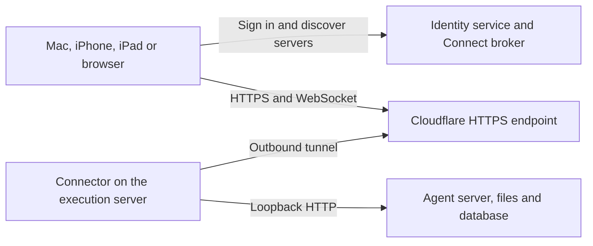

# T3 Connect and Bloom remote access

Investigated 9 September 2026 against T3 Code commit
[`6c583620`](https://github.com/pingdotgg/t3code/tree/6c583620ff7ad3235b135af7107c0543467eecfa).
This is a source and documentation review, not a live test of T3's hosted service.

T3 Connect is a useful model for making Bloom remote access easy on Mac, iPhone and iPad.
It removes the client VPN requirement by managing a Cloudflare Tunnel on the execution host.
However, the inspected implementation does not yet provide the complete authenticated gateway
for arbitrary development-server previews that Bloom needs for Laravel and Vite.

## What actually connects to what

The arrows to the broker describe discovery and authentication. The tunnel is bidirectional
after its outbound connection is established; normal app traffic traverses Cloudflare to the
execution server. The T3 relay Worker does not proxy those ongoing sessions.
[Architecture](https://github.com/pingdotgg/t3code/blob/6c583620ff7ad3235b135af7107c0543467eecfa/docs/internals/t3-connect.md),
[relay responsibilities](https://github.com/pingdotgg/t3code/blob/6c583620ff7ad3235b135af7107c0543467eecfa/infra/relay/README.md).

The server runs a managed `cloudflared` process. T3 pins and downloads the connector binary,
provisions a hostname and tunnel, and routes that hostname to a validated loopback HTTP service.
Other requests receive a 404. This does not require a Tailscale or Cloudflare VPN app on clients,
or inbound router forwarding for the execution server.
[Connector runtime](https://github.com/pingdotgg/t3code/blob/6c583620ff7ad3235b135af7107c0543467eecfa/apps/server/src/cloud/ManagedEndpointRuntime.ts),
[connector installation](https://github.com/pingdotgg/t3code/blob/6c583620ff7ad3235b135af7107c0543467eecfa/packages/shared/src/relayClient.ts),
[endpoint provisioning](https://github.com/pingdotgg/t3code/blob/6c583620ff7ad3235b135af7107c0543467eecfa/infra/relay/src/environments/ManagedEndpointProvider.ts),
[Cloudflare Tunnel](https://developers.cloudflare.com/tunnel/).

The user signs in on the host through `t3 connect`, then signs in on another device and chooses
the environment. SSH/headless setup uses a browser link and pasted authorization code, so the
user does not have to forward a login callback port. T3 also supports direct pairing, SSH and
Tailscale HTTPS.
[User flow](https://github.com/pingdotgg/t3code/blob/6c583620ff7ad3235b135af7107c0543467eecfa/docs/user/remote-access.md).

## Authentication and trust

T3 uses Clerk for account identity. Account sign-in is followed by a server-issued session:
the broker requests a one-time bootstrap credential bound to the client's proof key, and the
client redeems it at the execution server. The server enforces scoped permissions. Its session
credential is not returned to the broker. The broker remains trusted because it can authorise
bootstrap issuance; proof-bound credentials do not remove that authority.
[Connect trust boundary](https://github.com/pingdotgg/t3code/blob/6c583620ff7ad3235b135af7107c0543467eecfa/docs/internals/t3-connect.md).

Browser cookies and native-client credentials use the same session model. Native clients obtain
short-lived WebSocket tickets through authenticated HTTP, keeping long-lived credentials out
of socket URLs. Pairing cannot grant greater privileges than the issuer holds. Revocation is
separate from stopping an agent process.
[Environment authentication](https://github.com/pingdotgg/t3code/blob/6c583620ff7ad3235b135af7107c0543467eecfa/docs/internals/environment-auth.md).

This is HTTPS transport security through a trusted edge provider. It should not be described as
end-to-end encryption that hides application content from Cloudflare: Cloudflare terminates HTTPS
and can decrypt proxied traffic.
[Cloudflare's explanation](https://developers.cloudflare.com/ssl/faq/#why-do-i-see-a-cloudflare-certificate-when-an-ssl-certificate-is-installed-at-my-website).

## The preview limitation

The browser URL resolver explicitly refuses environment-port navigation when the environment
hostname is not privately reachable, referring to a "planned authenticated preview gateway".
The discovered-port convenience function catches this and returns the original URL; that does
not make a server's localhost reachable from a phone.
[Browser URL resolver](https://github.com/pingdotgg/t3code/blob/6c583620ff7ad3235b135af7107c0543467eecfa/apps/web/src/browser/browserTargetResolver.ts).

T3 does have signed file previews and sandboxed HTML documents. Those are useful for authored
artifacts, but do not by themselves proxy a running Laravel application, its cookies, redirects
and Vite WebSockets. Mattias supplies his own per-worktree Tailscale Serve setup for that purpose.
[Asset access](https://github.com/pingdotgg/t3code/blob/6c583620ff7ad3235b135af7107c0543467eecfa/apps/server/src/assets/AssetAccess.ts),
[HTML isolation](https://github.com/pingdotgg/t3code/blob/6c583620ff7ad3235b135af7107c0543467eecfa/apps/server/src/http.ts),
[Mattias's preview setup](https://ma.ttias.be/remote-coding-environment-vps/).

## What Bloom should adopt

These are proposed Bloom changes, not claims about features already implemented.

| T3 idea | Application in Bloom |
| --- | --- |
| Stable environment identity, independent of address | A saved server remains the same server across SSH, Tailscale and HTTPS changes. Scope remote workspace and session identities to it. |
| One execution model across connection methods | Keep the existing shared composer, sidebar, tabs and inspector. Change the transport beneath them. |
| Server-owned durable state | Every device reads the same projects, workspaces, sessions and approvals through the API. Never share the SQLite file with clients. |
| Account discovery plus device sessions | Sign in once, choose a server by its friendly name, and revoke a lost device without stopping server work. |
| Managed outbound connector | Install the connector with Bloom Server and automate hostnames. Users should not configure DNS for every workspace. |
| Client-side reachability verification | Offer a preview as ready only after the viewing device can reach it. A successful server-side request is insufficient. |
| Capability negotiation | A newer client can explain unavailable server features without requiring identical releases for every change. |

T3 explicitly separates environment identity from connection route and says only the connecting
client can establish reachability.
[Remote architecture](https://github.com/pingdotgg/t3code/blob/6c583620ff7ad3235b135af7107c0543467eecfa/docs/internals/remote.md).

For Bloom's previews, add an authenticated gateway with stable workspace-specific HTTPS origins.
Grant browser access to a particular preview, rather than giving preview JavaScript a credential
for controlling agents or reading arbitrary files. Keep control-API cookies and preview cookies
separate, including host scoping. Check authentication for pages, assets and WebSocket upgrades.
The gateway must route only registered workspace services, not arbitrary client-supplied URLs.

For Laravel, carry the external application and Vite addresses into workspace setup. Verify
redirects, cookies, assets and hot reload from the client device. A Safari launch needs its own
safe login handoff; the native app's bearer header does not automatically accompany that launch.

## Work and operating cost

Bloom currently carries its protocol over Unix sockets and SSH. The first implementation step is
an authenticated HTTP/WebSocket adapter for the same `ServerRuntime`, with device sessions,
revocation and browser authentication. A tunnel alone must not expose the existing unauthenticated
socket protocol. Mobile terminal access also needs a network stream instead of spawning SSH on
the device.

After that, add the preview gateway, then account discovery and managed connector provisioning.
Test those with ordinary HTTPS clients before building the iOS interface. Keep SSH and Tailscale
as usable connection methods throughout. Server processes must remain independent of client or
connector disconnects.

The full T3 deployment includes identity, a broker Worker, a database, tunnel/DNS management and
optional APNs/FCM notification services. We can choose a smaller stack, but somebody still needs
to operate it. The inspected code defaults to three managed environment allocations per user;
that is an implementation limit, not evidence of an unlimited free hosting offer.
[Relay deployment](https://github.com/pingdotgg/t3code/blob/6c583620ff7ad3235b135af7107c0543467eecfa/infra/relay/README.md),
[allocation limits](https://github.com/pingdotgg/t3code/blob/6c583620ff7ad3235b135af7107c0543467eecfa/infra/relay/src/environments/ManagedTunnelLimits.ts).

T3's source is MIT-licensed with notice-preservation requirements. Its TypeScript implementation
can inform a Swift server/client design, but this investigation has not established that T3's
hosted service is offered as infrastructure for unrelated apps. Plan for Bloom-owned infrastructure
and credentials rather than depending on that service.
[Licence](https://github.com/pingdotgg/t3code/blob/6c583620ff7ad3235b135af7107c0543467eecfa/LICENSE).

Recommended direction: authenticated HTTPS for the easy cross-device experience, with an optional
managed outbound tunnel for automatic setup. Retain Tailscale for users who prefer private-network
access. Build and verify preview authentication as part of that work; T3's connector does not
remove that requirement.
